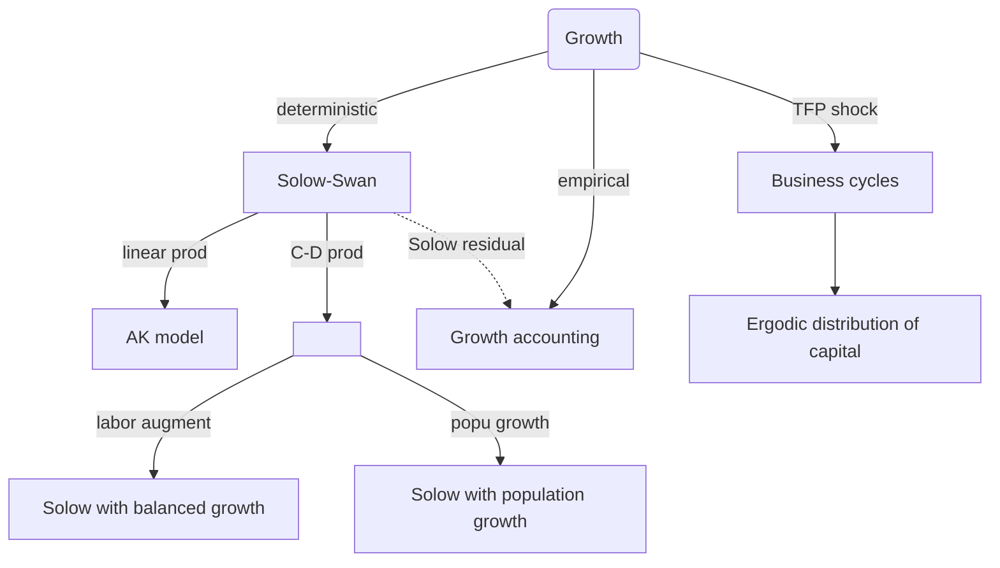
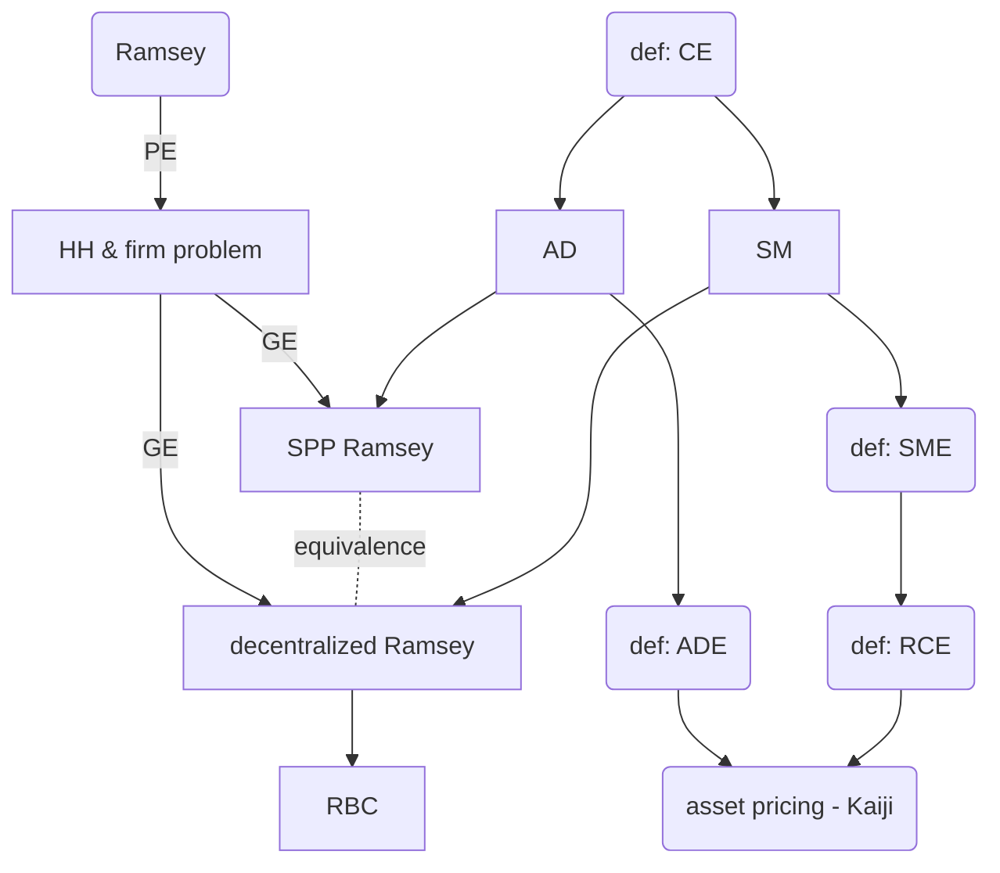
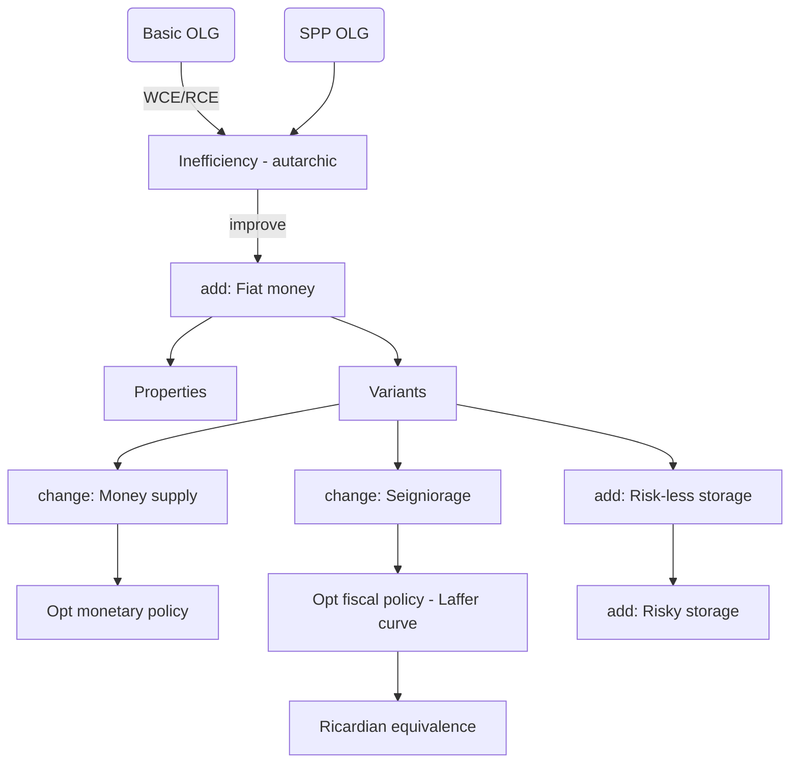
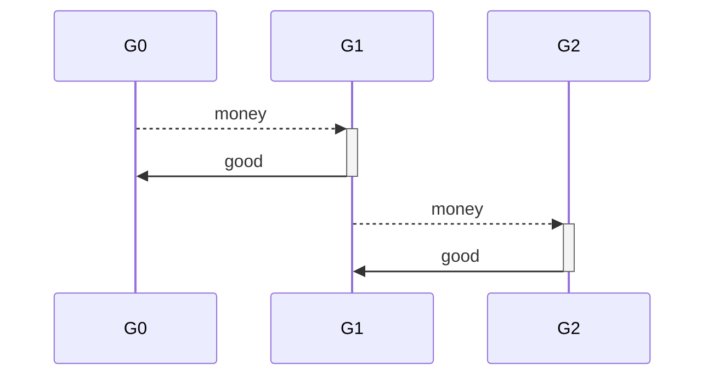
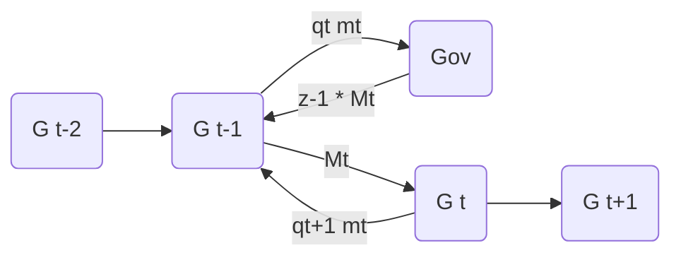
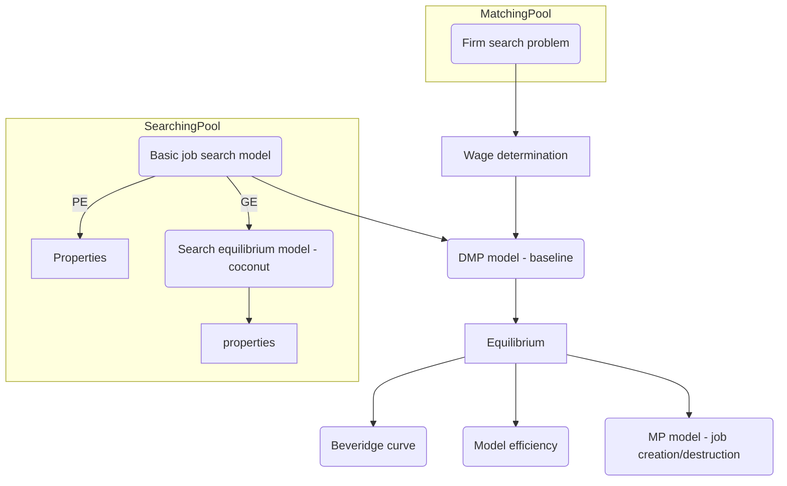

# Core exam notes - Macroeconomics
> Tianhao Zhao
> 
> May 2020

[toc]

## Ch.1 Solow-Swan

### 1.1 Purpose & mind map

1. What is the driver of growth?
2. Is long-term growth sustainable?

### 1.2 Solow (1956) & Swan (1956)

#### 1.2.1 Setup

Setup of basic Solow model is an equation system:
$$
\begin{align}
y_t &= F(h_t,k_t) \\
k_{t+1} &= (1-\delta)k_{t} + i_{t} \\
c_{t} + i_{t} &= y_{t} \\
i_{t} &= \sigma y_{t}
\end{align}
$$
whose state is $\{ k_t \}^\infty_{t=0}$. We concern sequences $\{y_t,c_t,k_t\}^\infty_{t=0}$.

Some required properties:

1. $F(\cdot,\cdot)$ is homogenous of degree 1, increasing, concave and $C^2$.
2. Let $h_t\equiv 1$
3. Inada condition satisfied s.t. $f'(0)=\infty$ and $\lim_{x\to\infty}f'(x)=0$ where $f(x):=F(1,k)$

#### 1.2.2 Features

1. Fixed saving rate/policy
2. No decision making

#### 1.2.3 Conclusion: Steady state of basic Solow-Swan

1. Using law of motion to pin down steady state capital level
2. **Proof**: existence & uniqueness of $k^*$
3. **Proof**: capital output ratio
4. **Proof**: steady state consumption depends on saving rate
5. **Proof**: Phelps' golden rule of capital accumulation (steady state $c^*$ as a function of $\sigma$)
6. **Proof**: zero long-term growth (dynamics converging to steady state)

#### 1.2.4 Conclusion: AK model

1. **Features**: linear production technology in $k$
2. **Proof**: conditions for economy to grow/shrink forever
3. **Proof**: condition to get persistent growth
4. **Proof**: scenarios under increasing/decreasing returns of production

#### 1.2.5 Conclusion: Balanced growth

1. **Features**: labor-augment technology; C-D production function
2. **Definition**: *balanced* growth (unit labor output & unit capital output grow at the same rate)
3. **Proof**: steady state $k/y$ ratio

#### 1.2.6 Conclusion: Population growth

1. **Features**: population growth; C-D production function
2. **Proof**: steady state $k/y$ ratio

### 1.3 Growth accounting

1. **Features**: TFP shock; C-D production
2. **Proof**: Solow decomposition of discrete/continuous time cases
3. **Definition**: Solow residual

### 1.4 Business cycle

1. **Features**: 2-state TFP shock
2. **Proof**: identify ergodic distribution for capital in a phase diagram $k\in(k_L,k_H)$

### 1.5 Dynamic optimizations

1. **Definition**: MRS, $MRS(c_{t+s},c_{t}):=\frac{ \partial U(c)/\partial c_{t+s} }{ \partial U(c)/\partial c_{t} }$
2. **Definition**: homothetic $U$
3. **Definition**: IES, $IES(c_{t+1},c_{t}):= -\left[\frac{ \partial MRS_{t+1,t}/\partial (\frac{c_{t+1}}{c_{t}}) }{ MRS_{t+1,t}/(\frac{c_{t+1}}{c_{t}}) }\right]^{-1}$
4. **Definition**: transversality condition (limit term of solving Euler equation)
5. **Theorem**: Blackwell’s sufficient condition
6. **Proof**: unimprovability: if utility function is bounded below, then look at one-shot deviation of Bellman

## Ch.2 Optimal growth (Ramsey)

### 2.1 Purpose & mind map

1. What is the driver of growth in a decentralized economy?

### 2.3 Partial equilibrium: HH & firm problem

1. **Proof**: be able to derive Euler equation with applying envelope theorem
2. **Definition**: transversality condition & its interpretation
3. **Algebra**: guess & verify HH policies
4. **Proof**: HH problem with labor-leisure choice
5. **Algebra**: compute transition dynamics given MIT shock
6. **Definition**: standard firm problem

### 2.4 Def: Stationary RCE

See Kaiji’s part.

### 2.5 Distortion: government

1. **Algebra**: SPP version of government purchase
2. **Algebra**: HH problem with lump-sum tax
3. **Proof**: analysis of welfare loss
4. **Definition**: RCE with distortion
5. **Proof**: steady state $k/y$ with distortion

### 2.6 Variant: idiosyncratic productivity shock

See Kaiji’s part.

### 2.7 RBC

See Kaiji’s part (aggregate TFP shock).

### 2.8 Asset pricing

See Kaiji’s part.

## Ch.3 Overlapping generations

### 3.1 Purpose & mind map

1. Welfare analysis on OLG models?
2. How to make economy with OLG structure efficient?
3. What if with distortions?

### 3.2 Basic OLG

#### 3.2.1 Setup (competitive HH of generation $G_t$)

$$
\begin{align}
\max_{c_{t1},c_{t2}} \ & u(c_{t1},c_{t2}) \\
\text{s.t}& \begin{cases} c_{t1}= e_1 - s_t \\
	c_{t2} = e_2 + R_t s_t
\end{cases}
\end{align}
$$

#### 3.2.2 Def: WCE & RCE

> A WCE is a sequence of prices and allocations $\{p_{t},c_{t1},c_{t2} \}^\infty_{t=1}$ s.t. $c_{02}=e_{2}$; given price $\{p_{t}\}$, $(c_{t1},c_{t2})$ solves the maximization problem of generation $G_t$ for all $t\geq 1$; and markets clear in the sense that for all $t$, $c_{t1}+c_{t-1,2}=e_{1}+e_{2}$.

> A RCE is a sequence of $\{ R_t,c_{t1},c_{t2} \}_{t=1}$ s.t. $c_{02}=e_2$; given sequential price $\{R_t\}$, $(c_{t1},c_{t2})$ solves the maximization problem of generation $G_t$ for all $t\geq1$; and market clearing holds for all $t$, $c_{t1}+c_{t-1,2}=e_{1}+e_{2}$.

#### 3.2.3 Conclusion: autarchic CE in basic OLG

1. **Proof**: solve competitive HH problem
2. **Proof**: show welfare loss cp. SPP allocation (failure of FWT)
3. **Proof**: FWT

#### 3.2.4 Conclusion: existence of CE in basic OLG

1. **Definition**: MRS, $\mu(c_{t1},c_{t2}):= \frac{ u_1(c_{t1},c_{t2}) }{ u_2(c_{t1},c_{t2}) }$
2. **Proof**:
   1. $\mu\geq1$: FWT holds (classical case)
   2. $\mu<1$: FWT fails (Samuelsonian case)

### 3.3 OLG with fiat money

#### 3.3.1 Setup

HH problem under WCE scenario:
$$
\begin{align}
	\max_{c_{t1},c_{t2},m_{t}} \ & u(c_{t1},c_{t2}) \\
	\text{s.t.} \ & p_t c_{t1} + p_{t+1}c_{t2} + q_{t}m_{t} = p_{t}e_1+p_{t+1}e_2 + q_{t+1} m_{t} \\
	& c_{tj}\geq 0,\forall j =1,2
\end{align}
$$
HH problem under RCE scenario:
$$
\begin{align}
	\max_{c_{t1},c_{t2},m_{t}} \ & u(c_{t1},c_{t2}) \\
	\text{s.t.} \ & c_{t1} = e_{1} - q_{t}m_{t} -s_{t}\\
				& c_{t2} = e_{2} + q_{t+1}m_{t} + R_{t}s_{t} \\
				& m_{t},c_{tj}\geq 0
\end{align}
$$
Money market in period $t$ (AD = AS):
$$
N_{t}m_{t} = N_{t-1} m_{t-1} = M
$$

#### 3.3.2 Properties

1. **Proof**: existence of RCE with money
2. **Proof**: equivalent economy with price of goods in terms of units of money $P_t := 1/q_{t}$
3. **Proof**: solve difference equation of money demand
4. **Proof**: conclusions about $\mu$ still holds
5. **Proof**: quantity theory of money
6. **Proof**: money is not super neutral

#### 3.3.3 Variant: with money growth

1. **Proof**: existence of steady state in terms of real balances
2. **Proof**: conditions for quantity theory of money holds
3. **Proof**: welfare analysis of money growth
4. **Proof**: money is super neutral under proportional transfers

#### 3.3.4 Variant: Seigniorage

1. **Proof**: Pareto improvement from funding government purchases through a lump-sum inflation tax
2. **Proof**: money is not super neutral
3. **Proof**: government’s revenue from collecting inflation tax
4. **Proof**: Laffer Curve (Bailey Curve)

#### 3.3.5 Variant: OLG with storage 

$$
\begin{align}
	\max_{c_{t1},c_{t2},m_{t},k_{t}} \ & u(c_{t1},c_{t2}) \\
	\text{s.t. } & c_{t1} = e_{1} - q_{t}m_{t} - k_{t} \\
				& c_{t2} = e_{2} + q_{t+1}(m_{t}+\tau_{t}) + x k_{t} \\
				& k_{t},c_{t1},c_{t2},m_{t}\geq 0
\end{align}
$$

1. **Proof**: conditions of existence of non-monetary equilibrium ($q_{t} \equiv 0$)
2. **Proof**: conditions of existence of monetary equilibrium ($xz \leq 1 \wedge \mu(e_1,e_2)z\leq 1$)
3. **Proof**: conditions of existence of monetary equilibrium with risky storage

### 3.4 Discussion: Fiscal policy

1. **Features**: non-monetary OLG economies
2. **Definition**: government policy $\{T_{t1},T_{t2},B_{t},q_{t},g_{t}  \}$ in which $q_t$ is price of zero-coupon treasury bond.
3. **Proposition**: Ricardian equivalence

## Ch.4 Search & match

### 4.1 Purpose & mind map

### 4.2 Basic job search model

#### 4.2.1 Setup

Suppose i.i.d wage process $\varepsilon_t\sim F(\varepsilon)$; suppose unemployment benefits $b$; suppose state variable $x_t$ which is period $t$‘s income. HH solves:
$$
\begin{align}
	V(x) = \max_{a\in\{0,1\} } \ & \left\{ aU(x) + (1-a)U(b) + \beta \mathbb{E}_tV\left( f(x,a,\varepsilon) \right)     \right\} \\
		\text{s.t. } \ & x' := f(x,a,\varepsilon) := \begin{cases}
			\varepsilon',  a = 0 \\ x,  a = 1
		\end{cases}
\end{align}
$$
where
$$
\begin{align}
	& \mathbb{E}_t V(f(x,1,\varepsilon)) = \frac{ U(x) }{1-\beta} \\
	& \mathbb{E}_t V(f(x,0,\varepsilon)) = \int V(\varepsilon) d F(\varepsilon)
\end{align}
$$

#### 4.2.2 Conclusion: wage determination

1. **Proof**: monotonicity optimal strategy, i.e. existence of reserved wage
2. **Proof**: $U(w^*)-U(b) =\frac{\beta}{1-\beta}\int_{w^*}^{x_{max}} (1-F(\varepsilon))U'(\varepsilon)d\varepsilon$
3. **Proof**: comparative statics, $dw^*/db$
4. **Proof**: comparative statics, $dw^*/d\beta$

### 4.3 Search equilibrium model (producing economy)

#### 4.3.1 Setup

$$
\begin{align}
	\text{Production sector: } & V_0 = -\gamma_0 + \beta\left[ \alpha_0\int\max(V_1-c,V_0)dF(c) + (1-\alpha_0)V_0    \right] \\
	\text{Exchange sector: } & V_1 = -\gamma_1 + \beta\left[ \alpha_1(u+V_0) + (1-\alpha_1)V_1   \right]
\end{align}
$$

#### 4.3.2 Conclusion: Equilibrium

1. **Proof**: existence of reservation cost $k$
2. **Proof**: necessary conditions for steady state
3. **Proof**: steady state (population) distribution $n$
4. **Proof**: $dk/dn$

### 4.4 Baseline matching model (DMP model)

## Ch.5 Asset pricing

## Ch.6 Market structure: complete market

## Ch.7 CS model: CCIH

## Ch.8 CS model: PILCH

## Ch.9 CS model: PILCH variants

## Ch.10 Wealthy hand-to-mouth

