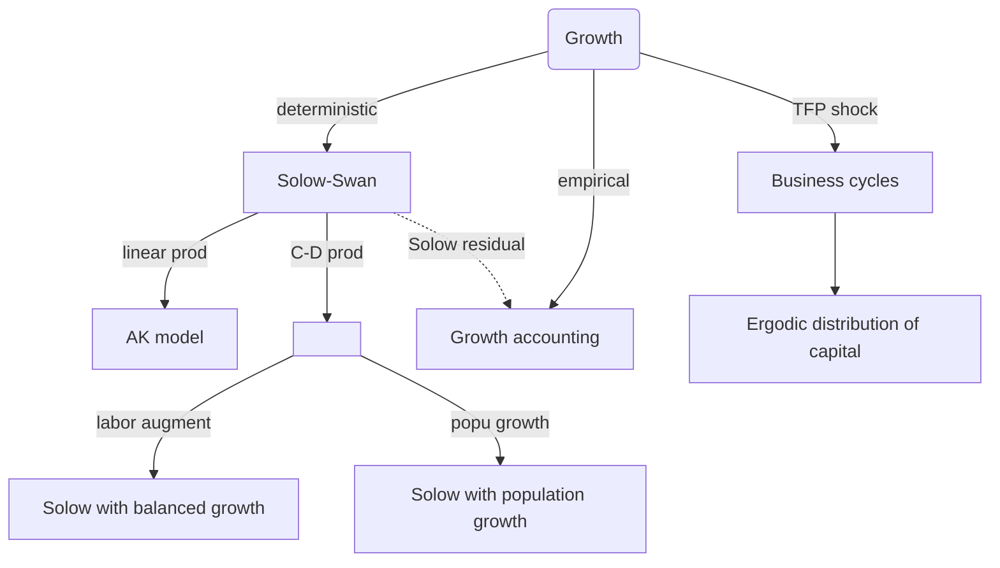
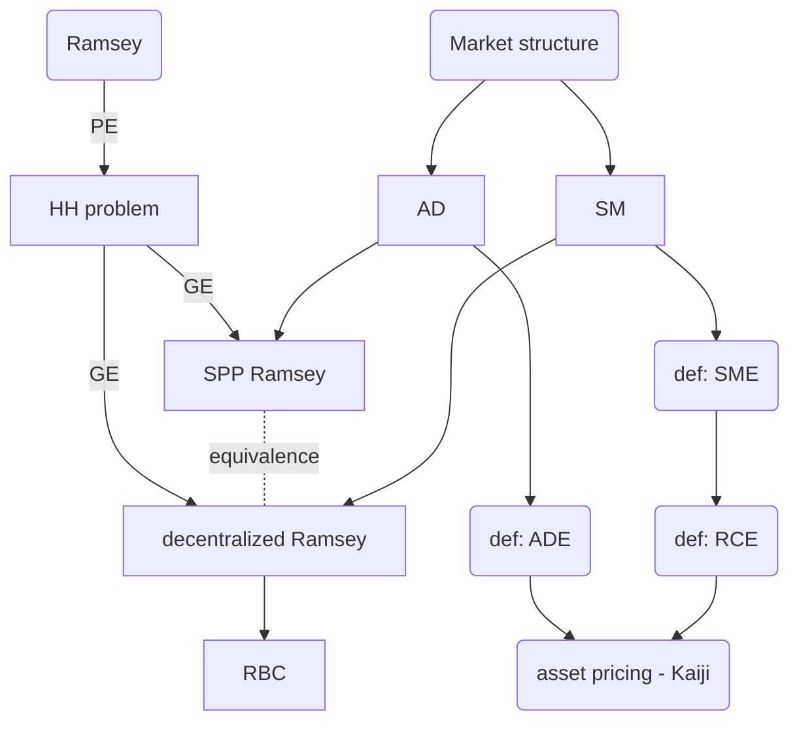

# Core exam notes - Macroeconomics
> Tianhao Zhao
> 
> May 2020

[toc]

## Ch.1 Solow-Swan

### 1.1 Purpose & mind map

1. What is the driver of growth?
2. Is long-term growth sustainable?

### 1.2 Solow (1956) & Swan (1956)

#### 1.2.1 Setup

Setup of basic Solow model is an equation system:
$$
\begin{align}
y_t &= F(h_t,k_t) \\
k_{t+1} &= (1-\delta)k_{t} + i_{t} \\
c_{t} + i_{t} &= y_{t} \\
i_{t} &= \sigma y_{t}
\end{align}
$$
whose state is $\{ k_t \}^\infty_{t=0}$. We concern sequences $\{y_t,c_t,k_t\}^\infty_{t=0}$.

Some required properties:

1. $F(\cdot,\cdot)$ is homogenous of degree 1, increasing, concave and $C^2$.
2. Let $h_t\equiv 1$
3. Inada condition satisfied s.t. $f'(0)=\infty$ and $\lim_{x\to\infty}f'(x)=0$ where $f(x):=F(1,k)$

#### 1.2.2 Features

1. Fixed saving rate/policy
2. No decision making

#### 1.2.3 Conclusion: Steady state of basic Solow-Swan

1. Using law of motion to pin down steady state capital level
2. **Proof**: existence & uniqueness of $k^*$
3. **Proof**: capital output ratio
4. **Proof**: steady state consumption depends on saving rate
5. **Proof**: Phelps' golden rule of capital accumulation (steady state $c^*$ as a function of $\sigma$)
6. **Proof**: zero long-term growth (dynamics converging to steady state)

#### 1.2.4 Conclusion: AK model

1. **Features**: linear production technology in $k$
2. **Proof**: conditions for economy to grow/shrink forever
3. **Proof**: condition to get persistent growth
4. **Proof**: scenarios under increasing/decreasing returns of production

#### 1.2.5 Conclusion: Balanced growth

1. **Features**: labor-augment technology; C-D production function
2. **Definition**: *balanced* growth (unit labor output & unit capital output grow at the same rate)
3. **Proof**: steady state $k/y$ ratio

#### 1.2.6 Conclusion: Population growth

1. **Features**: population growth; C-D production function
2. **Proof**: steady state $k/y$ ratio

### 1.3 Growth accounting

1. **Features**: TFP shock; C-D production
2. **Proof**: Solow decomposition of discrete/continuous time cases
3. **Definition**: Solow residual

### 1.4 Business cycle

1. **Features**: 2-state TFP shock
2. **Proof**: identify ergodic distribution for capital in a phase diagram $k\in(k_L,k_H)$

### 1.5 Dynamic optimizations

1. **Definition**: MRS, $MRS(c_{t+s},c_{t}):=\frac{ \partial U(c)/\partial c_{t+s} }{ \partial U(c)/\partial c_{t} }$
2. **Definition**: homothetic $U$
3. **Definition**: IES, $IES(c_{t+1},c_{t}):= -\left[\frac{ \partial MRS_{t+1,t}/\partial (\frac{c_{t+1}}{c_{t}}) }{ MRS_{t+1,t}/(\frac{c_{t+1}}{c_{t}}) }\right]^{-1}$
4. **Definition**: transversality condition (limit term of solving Euler equation)
5. **Theorem**: Blackwell’s sufficient condition
6. **Proof**: unimprovability: if utility function is bounded below, then look at one-shot deviation of Bellman

## Ch.2 Optimal growth (Ramsey)

### 2.1 Purpose & mind map

### 2.2 Partial equilibrium: HH problem

1. **Proof**: be able to derive Euler equation with applying envelope theorem
2. **Definition**: transversality condition & its interpretation

## Ch.3 Overlapping generations

## Ch.4 Search & match

## Ch.5 Asset pricing

## Ch.6 Market structure: complete market

## Ch.7 CS model: CCIH

## Ch.8 CS model: PILCH

## Ch.9 CS model: PILCH variants

## Ch.10 Wealthy hand-to-mouth

